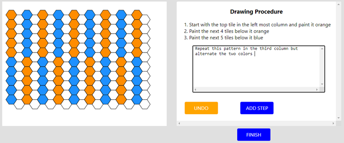
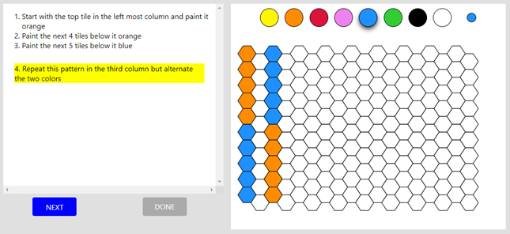

## GAME

The Hexagons game is a 2-player instruction following game. 

&#x1F481; <b> The Instructor </b>   
The Instructor gets a target image on the Hexagons board and has to provide instructions for how to draw the image step by step.   
Click the button to play the Instructor role.

<form action="https://nlp.biu.ac.il/~royi/hexagon-app-collection-demo/#/login">
	<button id="full_screen" type="button" class="btn btn-primary btn-sm" >Instructor Demo</button>
</form>

another button
<a href="https://nlp.biu.ac.il/~royi/hexagon-app-collection-demo/#/login" class="btn btn-primary btn-sm">Instructor Demo2</a>

&#x1F481; <b> The Executor </b>   
The Executor gets the instructions and has to execute them one by one on a blank Hexagons board in order to reconstruct the target image.  
Click here to play the Instructor role

<button id="full_screen" type="button" class="btn btn-primary btn-sm" onclick="fullScreen_ex()">Executor Demo</button>

(Under construction)

[Home](/hexagonsDemo)

