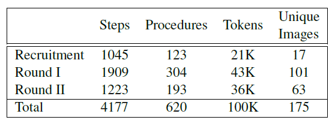

## DATASET
The Hexagons dataset comprises 4177 naturally-occurring visually grounded instructions rich with diverse types and levels of abstractions. 
The dataset as well as the evaluation of its quality is described in the [paper]().  

The following table summarizes some of its properties.  

The dataset is split to train, dev, and test and may be downloaded [here](). 